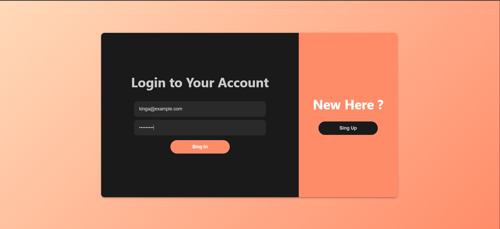
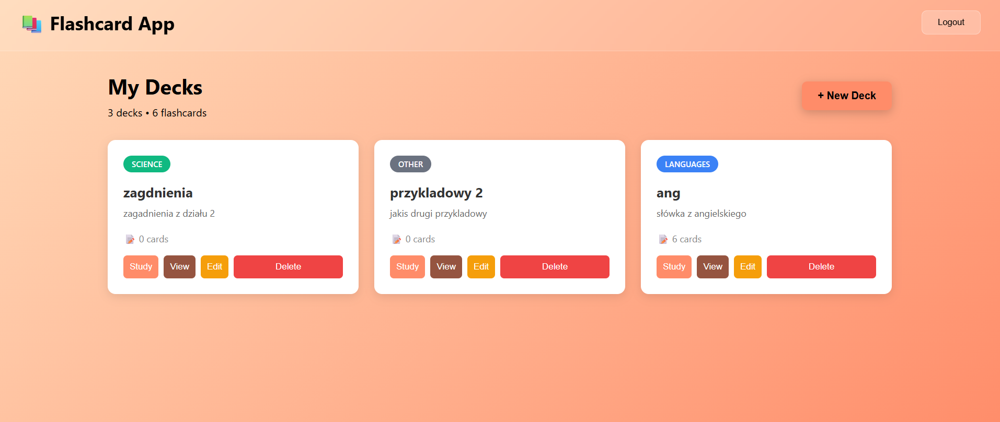
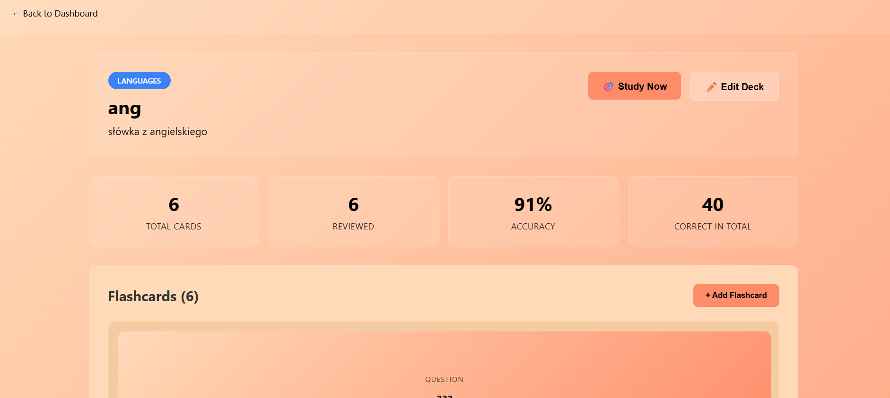
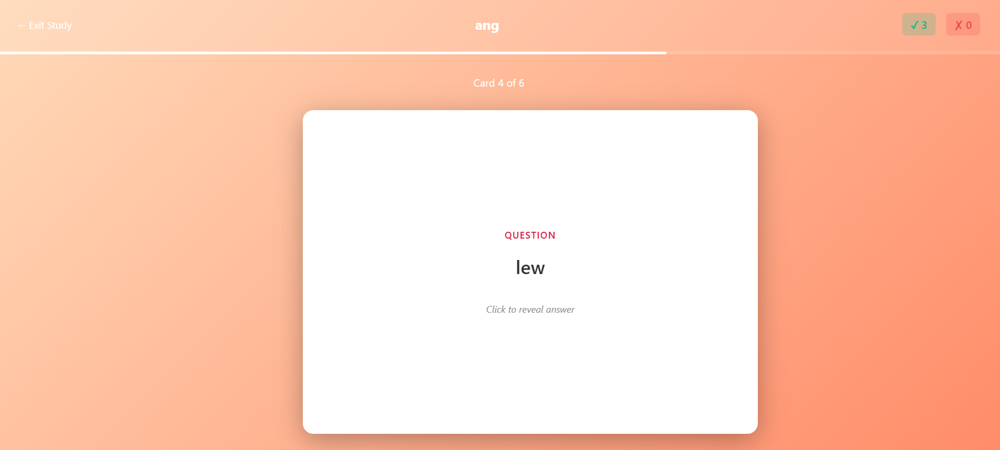

# 📚 Flashcard Learning App
Aplikacja będąca elementem zaliczenia przedmiotu **Szkielety programistyczne w aplikacjach internetowych**
**Autor:** Kinga Kowalska  

---

## Opis projektu

Flashcard Learning App to nowoczesna aplikacja webowa do nauki przez fiszki, umożliwiająca efektywne zapamiętywanie informacji poprzez aktywne przypominanie. Aplikacja oferuje intuicyjny interfejs do tworzenia własnych talii fiszek, śledzenia postępów oraz interaktywny tryb nauki z animowanymi kartami.

## Funkcjonalności  --- to inaczej

### 🔐 Autoryzacja i bezpieczeństwo
- **Rejestracja** z walidacją złożoności hasła
- **Logowanie** z tokenami JWT (ważnymi 7 dni)
- **Hashowanie haseł** algorytmem bcrypt

- ✅ **Hashowanie haseł** algorytmem bcrypt (SALT=10)
- ✅ **JWT tokens** z wygaśnięciem po 7 dniach
- ✅ **Middleware autoryzacji** sprawdzający token przy każdym żądaniu
- ✅ **Walidacja danych** po stronie serwera (Joi) i klienta (HTML5)
- ✅ **CORS** włączony dla bezpiecznej komunikacji
- ✅ **Zabezpieczenie przed NoSQL Injection** przez Mongoose

### 📚 Zarządzanie taliami
- **CRUD** - tworzenie, przeglądanie, edycja, usuwanie talii
- **Kategoryzacja** - Languages, Science, History, Programming, Other
- Licznik fiszek w każdej talii

### 📝 Zarządzanie fiszkami
- **CRUD** - pełne zarządzanie fiszkami w taliach
- **Flip animation** - animowane karty 3D do podglądu
- Przód i tył fiszki (pytanie/odpowiedź)
- Limit 500 znaków na stronę

### 🎯 Tryb nauki
- Losowe mieszanie fiszek
- Interaktywne odwracanie kart (3D flip)
- Oznaczanie odpowiedzi jako poprawne/niepoprawne
- **Podsumowanie sesji** z dokładnością procentową
- Pasek postępu nauki

### 📊 Statystyki i postępy
- Liczba przeglądniętych fiszek
- Procent poprawnych odpowiedzi
- Historia odpowiedzi (correct/incorrect)
- Śledzenie postępów dla każdej talii

---

## 🖼️ Zrzuty ekranu

### Strona logowania


### Dashboard z taliami


### Szczegóły talii z fiszkami


### Tryb nauki


### Statystyki po sesji nauki


---

## 🛠️ Technologie

### Backend (Serwer)
- **Express.js 5.2.1** - framework webowy
- **MongoDB 8.2** - nierelacyjna baza danych
- **Mongoose** - ODM dla MongoDB
- **JWT** - autoryzacja tokenu
- **bcrypt** - hashowanie haseł
- **Joi** - walidacja danych
- **joi-password-complexity** - walidacja złożoności hasła

### Frontend (Klient)
- **React.js 19.2.3** - biblioteka UI
- **React Router DOM** - routing
- **Axios** - komunikacja HTTP
- **CSS Modules** - stylowanie komponentów

### Architektura
- **Wzorzec MVC** - separacja logiki, danych i widoku
- **REST API** - standard komunikacji
- **CORS** - komunikacja cross-origin

---

## 📋 Wymagania systemowe
Node.js   v22.20.0 lub nowszy
MongoDB   v8.2 lub nowszy
npm       v10.9.3 lub nowszy
React     v19.2.3
Express   v5.2.1

---

## 🚀 Instalacja i uruchomienie

### 1. Klonowanie repozytorium
```bash
git clone https://github.com/twoja-nazwa/flashcard-app.git
cd flashcard-app
```

### 2. Uruchomienie MongoDB
Upewnij się, że MongoDB jest uruchomione na `localhost:27017`

### 3. Konfiguracja Backend

```bash
cd server
npm install
```

Utwórz plik `.env` w folderze `server/`:
```env
DB=mongodb://localhost/flashcard_app
JWTPRIVATEKEY=your_secret_key_here_change_this
SALT=10
PORT=3001
```

Uruchom serwer:
```bash
npm start
```

Serwer będzie dostępny na `http://localhost:3001`

### 4. Konfiguracja Frontend

```bash
cd client
npm install
npm start
```

Aplikacja będzie dostępna na `http://localhost:3000`

---

## 👤 Konta testowe

Możesz zalogować się na gotowe konta testowe:

### Konto 1
Email: kinga@example.com
Hasło: Haslo123.
*Lub zarejestruj nowe konto przez formularz rejestracji*

---
## 🔒 Bezpieczeństwo -- to si e powtarza

- ✅ **Hashowanie haseł** algorytmem bcrypt (SALT=10)
- ✅ **JWT tokens** z wygaśnięciem po 7 dniach
- ✅ **Middleware autoryzacji** sprawdzający token przy każdym żądaniu
- ✅ **Walidacja danych** po stronie serwera (Joi) i klienta (HTML5)
- ✅ **CORS** włączony dla bezpiecznej komunikacji
- ✅ **Zabezpieczenie przed NoSQL Injection** przez Mongoose

---

## 📝 Ważne uwagi

1. **MongoDB** musi być uruchomione przed startem aplikacji
2. **Backend i Frontend** muszą działać jednocześnie (dwa terminale)
3. Baza danych tworzy się **automatycznie** przy pierwszym uruchomieniu
4. Nie commituj pliku `.env` do repozytorium (zawiera sekrety)
5. Fiszki są **prywatne** - każdy użytkownik widzi tylko swoje dane

---

## 🎓 Wykorzystane koncepcje programistyczne -- powtorzone 

- **Wzorzec MVC** - separacja logiki biznesowej, danych i widoku
- **REST API** - standardowy interfejs komunikacji
- **JWT Authentication** - bezstanowa autoryzacja
- **CRUD Operations** - pełne zarządzanie zasobami
- **Async/Await** - asynchroniczne operacje
- **Middleware Pattern** - przetwarzanie requestów
- **Component-based Architecture** - React komponenty
- **CSS Animations** - płynne animacje 3D
- **State Management** - React hooks (useState, useEffect, useCallback)
- **Protected Routes** - routing z autoryzacją

## 📄 Licencja

Projekt edukacyjny stworzony na potrzeby zaliczenia przedmiotu.

Stwórz folder screenshots/ w głównym katalogu
Dodaj zrzuty ekranu z nazwami:

login.png
dashboard.png
deck-detail.png
study-mode.png
results.png


Możesz zmienić linki do swoj